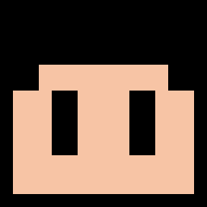

# ColorLess

Repository of the game _"ColorLess"_ created by [SavanDev (me!)](https://twitter.com/dylnavas36).

Made for [Mejorando Ando](https://itch.io/jam/mejorando-ando-mayo2021).

## Context

In this game I wanted to express how I have felt these last few days, while trying to improve with HaxeFlixel.

Its average duration should not exceed 5-7 minutes, but it can be extended when trying to achieve the true ending.

## Build

For compile the game, __first__... you need:

- Install [Haxe](https://haxe.org/download/).
- Install [HaxeFlixel](https://haxe.org/download/).

Later, you need install this __additional libraries__ (depending your target platform):

### For desktop
> haxelib install flixel-addons

_(The game was made for run only on desktop platform.)_

Now for finally compiled the game, well... is exactly as [Friday Night Funkin](https://github.com/ninjamuffin99/Funkin#compiling-game) but I detail here anyway.

### Hashlink

- Download [Hashlink](https://github.com/HaxeFoundation/hashlink/releases).
- Decompress the zip (in a fixed folder).
- Run "lime setup hl" and follow the steps.
- In the root game folder, now run "lime test hl -debug".

And that's all.

### Windows/Linux

Detailed explication for [Windows](https://lime.software/docs/advanced-setup/windows/) and [Linux](https://lime.software/docs/advanced-setup/linux/).

Simply... in Windows run:

> lime setup windows

or in Linux:

> lime setup linux

and follow the steps.

Later, just run "lime test windows -debug" (on Windows) or "lime test linux -debug" (on Linux) in the root folder.

## Special credits

- Music made by [Joshua McLean](https://joshua-mclean.itch.io).

Licensed under [Creative Commons Attribution 4.0 International](https://creativecommons.org/licenses/by/4.0/).
